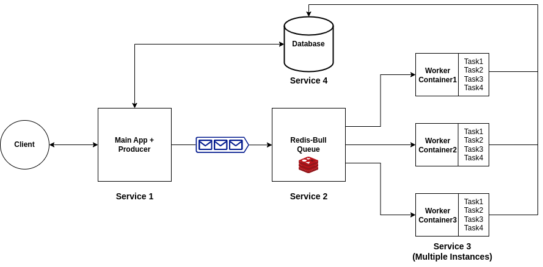

# Atlan-Assignment

## Contents
- [Problem Statement](#problem-statement)
- [System Architecture](#system-architecture)
- [Architecture Details](#architecture-details) (Pros/Cons & Solutions)
- [Steps to run](#steps-to-run)
- [API endpoints](#api-endpoints)
    - [1. /api](#1-api) (API status)
    - [2. /api/task](#2-task) (POST tasks to main server)
        - [2.1. Task 1](#21-task1)
        - [2.2. Task 2](#22-task2)
        - [2.3. Task 3](#23-task3)
        - [2.4. Task 4](#24-task4)
- [Features](#features)

## Problem Statement
The lifecycle of data collection via Collect does not end with the submission of a response. There is usually some post-submission business logic that Collect needs to support over time. This solution must be failsafe, should eventually recover from circumstances like power/internet/service outages, and should scale to cases like millions of responses across hundreds of forms for an organization.

This is a internship task for a Backend Developer Internship where the task given is to build a solution for providing large scale concurrency in long running tasks.

## System Architecture



### Architecture Details

The solution provides large scale concurrency in long running tasks.

- #### Main Service
    All the requests of tasks will be hitting this service which will be putting the task inside a Bull Queue built on top of redis as a broker.
The app also makes a task entry into the database, in order to keep a record and use it accordingly in the future.

- #### Redis Service
    Redis service is created to use Bull queues which is built on top of Redis. Queues solve many different problems in an elegant way, from smoothing out processing peaks to creating robust communication channels between microservices or offloading heavy work from one server to many smaller workers.</br></br>
    **Pros** - Solves problems like power/internet/service outages, becomes failsafe, no single point of failure and robust communication.</br>
    **Cons** - In some rare case, if the redis service goes down then there is a possibility of losing data.</br>
    **Solution** - Queue system like SQS of AWS can be used to implement queues, which is always up as it is a commercial service.

- #### Worker Service
    Worker service will be completing the tasks, like language translation, google sheets data updation, data validation etc. Assuming these tasks takes long to complete, we will be needing multiple Worker Containers to run simultaneously which will be getting data through Redis-Bull Queue.<br/>
    If the one worker container goes down, and the task remains unfinished then the queue handels the problem to pass the task to another container.

- #### Health Service
    This service is used to regulary check the health of the services after set amount of time. If the service finds any critical service down, then it immediately notifies the developers.

- #### Database Service
    The tasks generated on the main service and the results of validated data and translated data (slang) responses will be stored in the database for which we have used the database service.

## Steps to run

### Requirements
docker , docker-compose, bash
#### NOTE: Make sure to setup the both `.env` files with relevent details as provided in `.env.sample` in `main` and `worker` folders.

Use the `start.sh` script to run the `docker-compose` commands. Use the following command to build and start the services:
```bash
sudo bash start.sh
```

## API endpoints

#### 1. `/api`
```
URL: /api
Request type: GET
```

#### 2. `/task`

- #### 2.1. `Task1`
    ```
    Task: Translate the data to native language of MCQ question using Google Translate API
    URL: /api/task
    Request type: POST
    Task Type: 1
    Sample Request Data:
    {
        "userId": 1,
        "taskType": 1,
        "response": {
            "question": "Soccer is played with which equipment?",
            "city": "hi",
            "answer": "Ball"
        }
    }
    ```
    ##### Solution: Google translate API
    We use the Google Translate API to convert the targeted text to the language of the city. The result is stored in the database with the MCQ question and its answers.


- #### 2.2. `Task2`
    ```
    Task: Validate the data recieved by the users
    URL: /api/task
    Request type: POST
    Task Type: 2
    Sample Request Data:
    {
        "userId": 1,
        "taskType": 2,
        "response": {
            "monthly_income": 500,
            "monthly_savings": 550
        }
    }
    ```
    ##### Solution: Validate the fields
    Validate the fields, here if `monthly_income` > `monthly_savings` then the data is valid else not valid.

- #### 2.3. `Task3`
    ```
    Task: Organizing submitted data on Google Sheets through Google Sheets API
    URL: /api/task
    Request type: POST
    Task Type: 3
    Sample Request Data:
    {
        "userId": 1,
        "taskType": 3,
        "response": {
            "name": "John",
            "income": "98000",
            "age": "22"
        }
    }
    ```
    ##### Solution: Google Sheets API
    Used the Google Sheets API to write the data from the forms submitted by the user.</br></br>
    **Note** - Google sheets API has a limit of writting 60 writes per project per user per minute. So after 60 writes, the data will not be able to write on the sheets. To fix this multiple `keys.json` (upto 5) can be used to increase the number of writes to 300 per minute per project.

- #### 2.4. `Task4`
    ```
    Task: Send an SMS to the customer whose details are collected in the response
    URL: /api/task
    Request type: POST
    Task Type: 4
    Sample Request Data:
    {
        "userId": 1,
        "taskType": 4,
        "response": {
            "name": "Mike",
            "email": "mike@sample.com",
            "mobile": "1234567890"
        }
    }
    ```
    ##### Solution: SMS using fast-two-sms library
    Implemented SMS service using free trial of fast-two-sms service.

## Features

- Multiple Google Sheets API key implementation for increased writes (max 5 keys possible)
- Queue Implementation for Robust Communication
- MongoDB Transactions
- Horizontly scaling by increasing docker containers
- Health Check
- Complete 4 types of task which is failsafe
- Error logging and server logging
