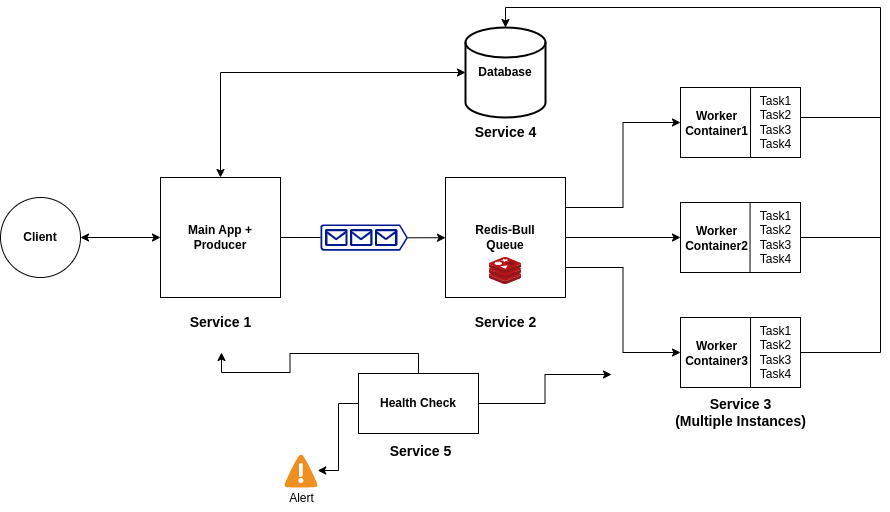

# Atlan-Assignment

## Implementation Memo

- Queue Implementation
- MongoDB Transactions
- Horizontly scaling by increasing docker containers
- Health Check
- Complete 4 tasks (With approaches)
- Error logging and server logging

## Architecture Diagram

## Requirements

    docker , docker-compose

## Installation Steps

    Let me code first !